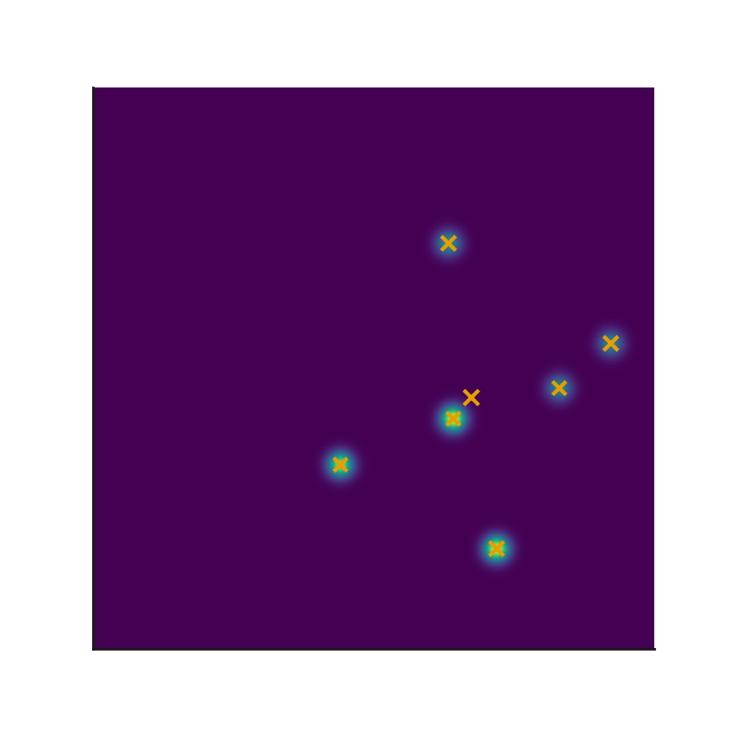
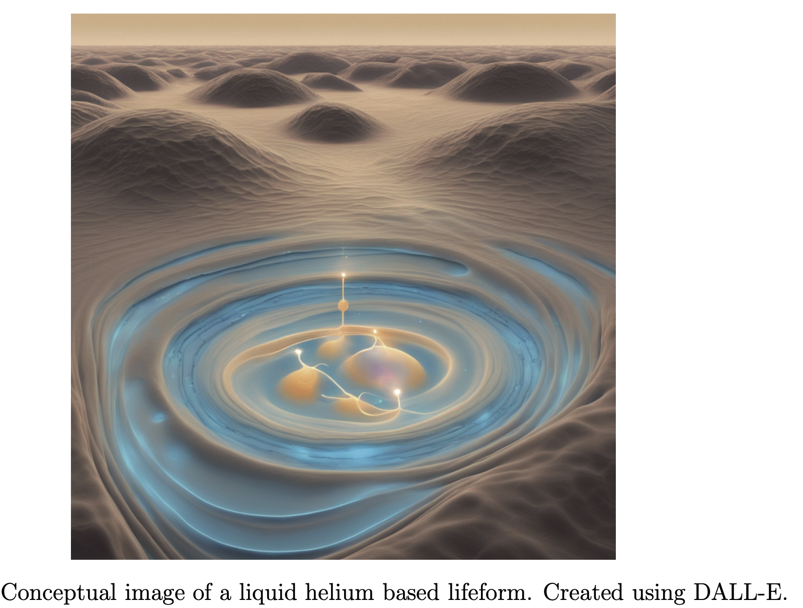

# llm_projects

Open source LLM projects

## Setup

* Create a `.env` file and store your OpenAI API key in it. It should have the format

```bash
OPENAI_API_KEY = <yourkey>
```

* Create a `.gitignore` file. It should have the following contents

```bash
.env
```

* Install Python

<!--
## Installation

```bash

pip install -r requirements.txt
```
-->

## Steps

```bash
python -m venv llm_venv

source llm_venv/bin/activate

pip install -r requirements.txt

python -m venv diffusion_venv

pip install -r requirements_diffusion.txt

python mental_health_chatbot.py

python alife_llm.py

deactivate
```


## Files

`.venv`: Create this file and save your OpenAI API key here. Add `.env` to your `.gitignore` file.

`langchain_simple.py`: A simple example of using `LangChain`

`mental_health_chatbot.py`: A mental health chatbot using OpenAI's model.

`simple_llm_github.py`: A simple LLM to call models.github.api/inference


`reflection_chart_generate.ipynb`: Multi agent system with reflection to create charts and refine it.

`diffusion_huggingface.py`: Python script to implement diffusion models for image generation using Hugging Face

`sql_agent_LLM.ipynb`: Agentic framework to perform SQL queries on database and refine queries based on output.

<!-->
`peft_gpt2_LORA.py`: Parameter Efficient Fine Tuning (PEFT) of GPT2 model using LoRA.
-->

`PEFT_pytorch_gpt2.py`: Parameter Efficient Fine Tuning (PEFT) of GPT2 model using LoRA using PyTorch on local machine.

`ai_security_evals.py`: AI security evaluations using Inspect AI framework from UK AI Security Institute (AISI).

`SAE_linear_probes.ipynb`: Sparse autoencoder (SAE) and linear probe

[Code](https://github.com/neelsoumya/llm_projects/blob/main/SAE_linear_probes.ipynb)

`probing_opensource_LLM_ideology.py`: Probing open source LLMs for hidden ideologies

[Code](https://github.com/neelsoumya/llm_projects/blob/main/probing_opensource_LLM_ideology.py)

`alife_llm.py`: Digital creatures (ALIFE creatures) in liquid helium evolved using LLMs


`llm_agent_currents.py`: LLM generated code that creates currents in superconductors.






## Contact

Soumya Banerjee

sb2333@cam.ac.uk

